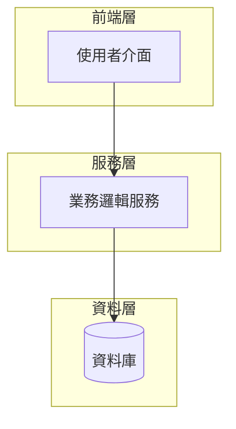

# 設計文件

## 概述

[系統的整體描述，包括主要功能和目標]

## 架構

### 整體架構



[架構說明文字]

### 架構層級

1. **[層級名稱]**：[描述]
2. **[層級名稱]**：[描述]
3. **[層級名稱]**：[描述]

## 元件和介面

### 1. [元件名稱]

[元件描述]

```typescript
interface ComponentName {
    method1(): ReturnType;
    method2(param: ParamType): ReturnType;
}

interface DataStructure {
    field1: Type;
    field2: Type;
}
```

### 2. [元件名稱]

[元件描述]

```typescript
interface ComponentName {
    method1(): ReturnType;
    method2(param: ParamType): ReturnType;
}
```

## 資料模型

### [模型名稱]

```typescript
interface ModelName {
    id: string;
    field1: Type;
    field2: Type;
    metadata: Record<string, any>;
    createdAt: Date;
    updatedAt: Date;
}
```

## 錯誤處理

### 錯誤類型

```typescript
enum ErrorType {
    TYPE1 = 'type1',
    TYPE2 = 'type2'
}

interface SystemError extends Error {
    type: ErrorType;
    code: string;
    details?: any;
    recoverable: boolean;
}
```

### 錯誤處理策略

1. **[錯誤類型]**：[處理方式]
2. **[錯誤類型]**：[處理方式]

## 測試策略

### 單元測試

- **[測試類別]**：[測試內容]
- **[測試類別]**：[測試內容]

### 整合測試

- **[測試類別]**：[測試內容]
- **[測試類別]**：[測試內容]

### 測試工具

```typescript
interface TestUtils {
    createMock(): MockType;
    simulateAction(action: Action): Promise<void>;
}
```

## 效能考量

### 最佳化措施

1. **[最佳化類別]**：[具體措施]
2. **[最佳化類別]**：[具體措施]

### 效能指標

```typescript
interface PerformanceMetrics {
    responseTime: number;
    throughput: number;
    resourceUsage: ResourceStats;
}
```

## 安全性

### 資料保護

1. **[安全措施]**：[描述]
2. **[安全措施]**：[描述]

### 隱私考量

1. **[隱私措施]**：[描述]
2. **[隱私措施]**：[描述]

## 部署和發布

### 部署流程

1. **[步驟]**：[描述]
2. **[步驟]**：[描述]

### 版本管理

1. **[版本策略]**：[描述]
2. **[版本策略]**：[描述]
