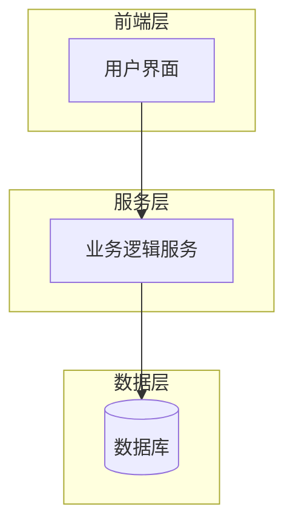

# 设计文件

## 概述

[系统的整体描述，包括主要功能和目标]

## 架构

### 整体架构



[架构说明文字]

### 架构层级

1. **[层级名称]**：[描述]
2. **[层级名称]**：[描述]
3. **[层级名称]**：[描述]

## 组件和接口

### 1. [组件名称]

[组件描述]

```typescript
interface ComponentName {
    method1(): ReturnType;
    method2(param: ParamType): ReturnType;
}

interface DataStructure {
    field1: Type;
    field2: Type;
}
```

### 2. [组件名称]

[组件描述]

```typescript
interface ComponentName {
    method1(): ReturnType;
    method2(param: ParamType): ReturnType;
}
```

## 数据模型

### [模型名称]

```typescript
interface ModelName {
    id: string;
    field1: Type;
    field2: Type;
    metadata: Record<string, any>;
    createdAt: Date;
    updatedAt: Date;
}
```

## 错误处理

### 错误类型

```typescript
enum ErrorType {
    TYPE1 = 'type1',
    TYPE2 = 'type2'
}

interface SystemError extends Error {
    type: ErrorType;
    code: string;
    details?: any;
    recoverable: boolean;
}
```

### 错误处理策略

1. **[错误类型]**：[处理方式]
2. **[错误类型]**：[处理方式]

## 测试策略

### 单元测试

- **[测试类别]**：[测试内容]
- **[测试类别]**：[测试内容]

### 集成测试

- **[测试类别]**：[测试内容]
- **[测试类别]**：[测试内容]

### 测试工具

```typescript
interface TestUtils {
    createMock(): MockType;
    simulateAction(action: Action): Promise<void>;
}
```

## 性能考量

### 优化措施

1. **[优化类别]**：[具体措施]
2. **[优化类别]**：[具体措施]

### 性能指标

```typescript
interface PerformanceMetrics {
    responseTime: number;
    throughput: number;
    resourceUsage: ResourceStats;
}
```

## 安全性

### 数据保护

1. **[安全措施]**：[描述]
2. **[安全措施]**：[描述]

### 隐私考量

1. **[隐私措施]**：[描述]
2. **[隐私措施]**：[描述]

## 部署和分发

### 部署流程

1. **[步骤]**：[描述]
2. **[步骤]**：[描述]

### 版本管理

1. **[版本策略]**：[描述]
2. **[版本策略]**：[描述]
